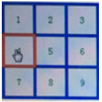

# 记录在前端路上碰到的各种问题，便于日后查阅

## 目录
- 为什么用style属性获取不到DOM节点的宽高？元素的各种宽高代表什么？[a.html](./a.html)
- 字符串的length和Buffer类的length有什么区别？[b.js](./b.js)
- 如何将重叠的border进行悬浮显示，且不影响其他布局？
	* [c文件夹](./c)
	* 目标效果:
- 去除内联元素的左右和下方空白间隙？[d.html](./d)
- 清除浮动？明白浮动元素会脱离正常文档流这点是最重要的。[e.html](./e.html)
- form表单如果不填写action属性会怎么样？[f.html](./f.html)